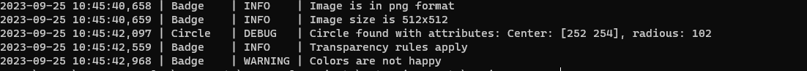
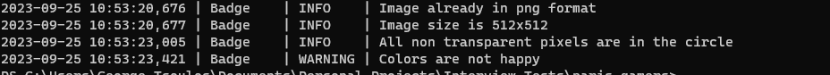
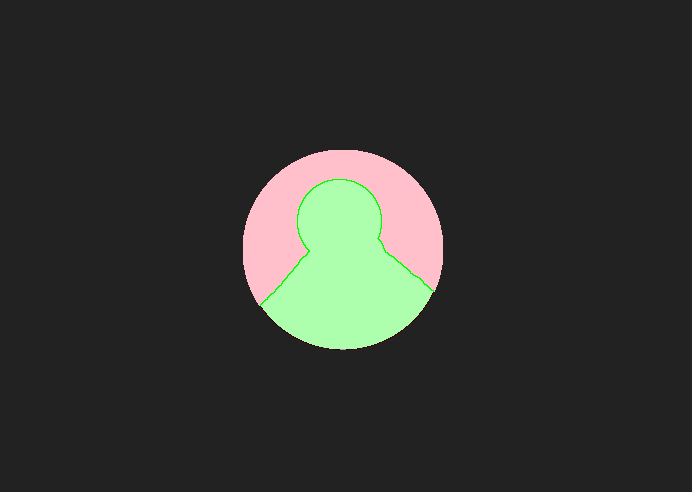

# Playmakers exercise

### Description

The goal of this exercise is to have a program read a badge (image with circle and some avatar in the middle) and making sure the following conditions apply:
    
* image should be png and 512x512 dimentions
* image non transparent pixels are within the circle
* the colors in the image give a happy feeling

Following this instructions I created this python project.

### Installation

For the purposes of the project I used `python-3.8.6` and from libraries I only used `numpy` for some array operations, `pillow` for the image operations and `opencv` for detecting the image circle. All these can be found in the `Pipfile` and be installed with:
```
pip install pipenv
pipenv install
```
If you encounter any problems with pipenv you can just run:
```
pip install pillow
pip install numpy
pip install opencv-python
```
which will install all the dependencies needed.

### Project Structure

For the project structure I tried to keep everything simple and on the same level since there is not too much programming complexity. I have created the following scripts/modules:
1. `main.py`: used for running the project
2. `Badge.py`: Module used for the basic badge operations, validation or the conditions and transorfming badge accordingly
3. `Circle.py`: Module used for circle operations, detection etc.
4. `Config.py`: Module used for project configuration. Values there can be changed but I do not guarantee the project will work this way :)
5. `Logger.py`: Module used for logging.

The `images` folder has some test images you can use stored.
The `logs` contains the logs as you can imagine.

### Run the project

The project has 2 modes:
1. **Checks** : making sure the conditions apply - Default mode
2. **Transformation** : transforming the image so that the rules apply. This mode will be activated if param `-T` is passed from terminal

Also, for simplicity I have provided a few **test images** (I created those and as you can tell I don't do design) under the `images` folder.
The images with *-h* are the ones with happy colors and the number after `avatar` is the radious.
> E.g. `avatar200r-h` is image with circle radious 200 and happy colors

#### Checks

To run the project and check one of the images we can simply run:

```
python3 .\main.py .\images\avatar100r.png
```

After run the outcome should be:

Basically we will be informed that image is indeed in **png format** and **512x512 dimentions**. Then we will see the detected circle on the image and be informed of the circle attributes At this point we need to **close the image window**. This message is for debug reasons but I thought it might be interesting for you as well. After that follow the checks for **transparency** and **happy colors**

#### Transformations

If we decide to run our project and want to transform the image we have to run something like:

```
python3 .\main.py .\images\avatar100r.png -T
```

Similarly our console will look something like this and after the program informs us if the transformation of the image to 512x512 and png need to happen or has happened, it will show us again detected circle. After we *close* the window, it will make all non-transparent pixels outside of circle transparent and make the colors happy:

E.g

Transformed to 



Please try out yourselves and let me know of your thoughts.